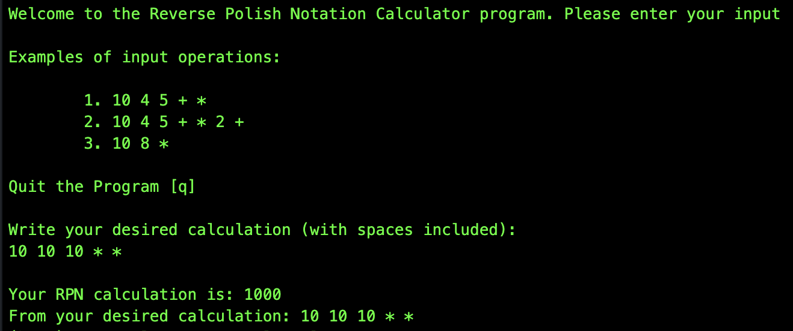

# **Reverse Polish Notation (RPN) Calculator** #
This is a Reverse Polish Notation (RPN) calculator for the command line.

## How to Use This Calculator ##
Clone this repo to your machine and play along!

To use RPN Calculator in the command line, you must have Node installed on your machine as well as node_modules in the repository.

-- In your terminal --
To check for Node, simply type: `node -v`
To install node_modules, simple type: `npm install`

You may write each calculation directly in the console after running the file.

Follow the instructions in the program. Here are the steps to get started:

1. `node index.js`
2. Input your calculations such as `5 5 5 8 + + -`
3. The program runs (and ends) according to your input!

## Technical Architecture ##
The general logic behind evaluating the RPN:

- Create new Array and let values be scoped within evaluation function
- Set values to user input and split the new array between numbers
- Set new function Calculate() to take in user input
- Loop through all items of user input
  - If item is not an operator value, then push these evaluated values to a stack
  - Else, if item is a numeric value, then pop two numerics from the stack and evaluate based on the switch statement cases

## Improvements to be Made ##
The following items could be made as improvements:

- Instead of using eval (since it is not secure), there could be a forEach loop that takes in the item, index, and array.
- This could probably use additional testing features for edge cases, such as ^ and decimal values
